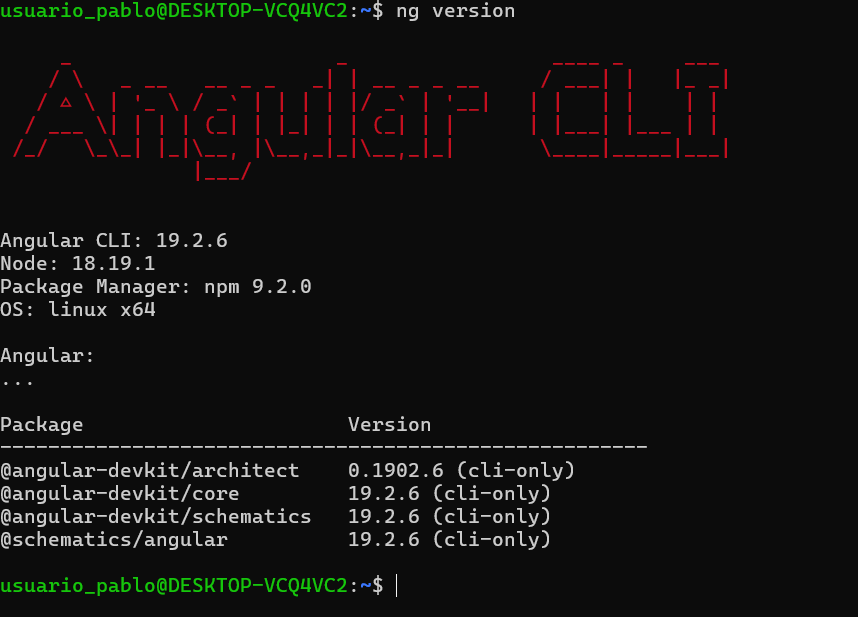

# Práctica: Configuración de un Proyecto Angular en Linux (WSL)

## 1. Título

**Configuración y Ejecución de un Proyecto Angular en WSL2**

## 2. Tiempo de duración

Aproximadamente ** 180 minutos**.

## 3. Fundamentos

Para desarrollar aplicaciones modernas con Angular, es importante comprender el entorno de desarrollo y las herramientas necesarias. En este caso, usaremos **WSL2** (*Windows Subsystem for Linux*), que permite ejecutar un sistema Linux dentro de Windows sin necesidad de una máquina virtual.

**Angular** es un framework de desarrollo basado en TypeScript que permite la creación de aplicaciones web SPA (*Single Page Applications*). Se ejecuta en un entorno Node.js y usa paquetes gestionados por npm (*Node Package Manager*).


- **WSL2**: Permite ejecutar Linux dentro de Windows sin virtualización pesada.
- **Ubuntu**: Es una distribución de Linux utilizada en este entorno.
- **Node.js**: Plataforma que permite la ejecución de JavaScript en el backend.
- **Angular CLI**: Herramienta de línea de comandos para la creación y gestión de proyectos Angular.

(Se incluirán imágenes explicativas de cada concepto)


 


### Conceptos clave:
## 4. Conocimientos previos

Para realizar esta práctica, el estudiante necesita conocer:

- Comandos básicos de Linux.
- Uso de terminal en Windows.
- Conceptos de desarrollo web.
- Instalación de software en Linux.

## 5. Objetivos a alcanzar

- Configurar y ejecutar un proyecto Angular en Linux usando WSL2.
- Comprender la instalación y configuración de **Node.js** y **Angular CLI**.
- Servir una aplicación Angular en `localhost:4200` desde un entorno Linux dentro de Windows.

## 6. Equipo necesario

- Computador con **Windows 10/11**.
- **WSL2** habilitado con **Ubuntu** instalado.
- **Node.js** y **npm** instalados.
- **Angular CLI** instalado.

## 7. Material de apoyo

- [Documentación de Angular](https://angular.io/)
- [Documentación de WSL](https://learn.microsoft.com/en-us/windows/wsl/)
- Guía de comandos básicos de Linux.
- Guía video colocado en la plataforma virtual del Instituto https://drive.google.com/file/d/1OitqZ02pX7VHaVx3qH9eF31mQent65rk/view
## 8. Procedimiento

### Paso 1: Instalar WSL2 y Ubuntu
Ejecutar en **PowerShell** como administrador e instalar solo por medio de comandos tanto **wsl** como **Ubuntu**:

```sh
wsl --install -d Ubuntu
```

 - Captura: 


### Paso 2: Instalación de Windows Subsystem for linux
Instalación de  **WSL2** (*Windows Subsystem for Linux*) en nuestro ordenador para el funcionamiento de comandos.


- Captura: 


### Paso 3: Instalar Node.js y npm
Ejecutar en la terminal de **Ubuntu** y confirmar las correcta instalación de todos los paquetes necesarios para la ejecución de los comando de linux:

```sh
sudo apt update && sudo apt upgrade -y
curl -fsSL https://deb.nodesource.com/setup_18.x | sudo -E bash -
sudo apt install -y nodejs
node -v  # Verificar versión
npm -v   # Verificar versión
```
- Captura: 


### Paso 4: Instalar Angular CLI

```sh
npm install -g @angular/cli
ng version
```

- Captura: 



### Paso 5: Crear un proyecto Angular

```sh
ng new linux-angular
cd linux-angular

```
- Captura: 


### Paso 6: Ejecutar el servidor de desarrollo, una vez todo haya sido completado mandaremos a correr  y verificamos que se ha creado el proyecto

```sh
ng serve
```

- Capturas: 


 
**Figura 1-1:** Captura de pantalla del proyecto ejecutado.


 

**Figura 1-2:** Captura de pantalla del servidor corriendo en `localhost:4200`.

## 9. Resultados esperados

- Instalación correcta de **WSL2** con **Ubuntu**.
- Instalación de **Node.js**, **npm** y **Angular CLI**.
- Creación y ejecución exitosa de un proyecto Angular.
- Visualización de la aplicación en el navegador en `localhost:4200`.

  ## 🔊 Audio Explicativo del Proyecto Angular en WSL2

<audio controls>
  <source src="audio/explicacion-angular.mp3" type="audio/mpeg">
  Tu navegador no soporta audio HTML.
</audio>


## 10. Bibliografía

- Angular Developers. (s.f.). *Angular Documentation*. Recuperado de [https://angular.io/docs](https://angular.io/docs)
- Microsoft. (s.f.). *Windows Subsystem for Linux Documentation*. Recuperado de [https://learn.microsoft.com/en-us/windows/wsl/](https://learn.microsoft.com/en-us/windows/wsl/)
